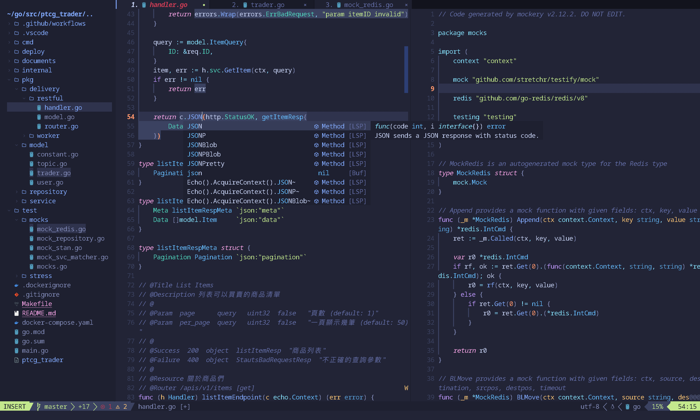

# ⚙️ dotfiles


## Getting Started

See more configurations in the [Makefile](/Makefile).

```bash
make all
```

- Neovim
  
  

- Zsh
  

- Fish Shell
  

- Vim
  

## Writer Guide

### Git Hooks

This repository use [pre-commit](https://github.com/pre-commit/pre-commit) to help developers keep the code quality.

If you install hooks, pre-commit will styling and linting before code committing.

```bash
# or check the installation page: https://pre-commit.com/#install
brew install pre-commit

pre-commit install --install-hooks -t commit-msg -t pre-commit
```

### Lint & Format

This repository use [EditorConfig](https://editorconfig.org/) and [editorconfig-checker](https://github.com/editorconfig-checker/editorconfig-checker) to help me keep the consistent coding styles :)

run below command to check format

```
editorconfig-checker
```

Also, we have [Prettier](https://prettier.io/) to further ensure the code format of the project.

run below command to check format

```
npx prettier --check **/*.{js,ts,md,json,yaml}
```

or use `--write` to directly re-write it

```
npx prettier --write **/*.{js,ts,md,json,yaml}
```
